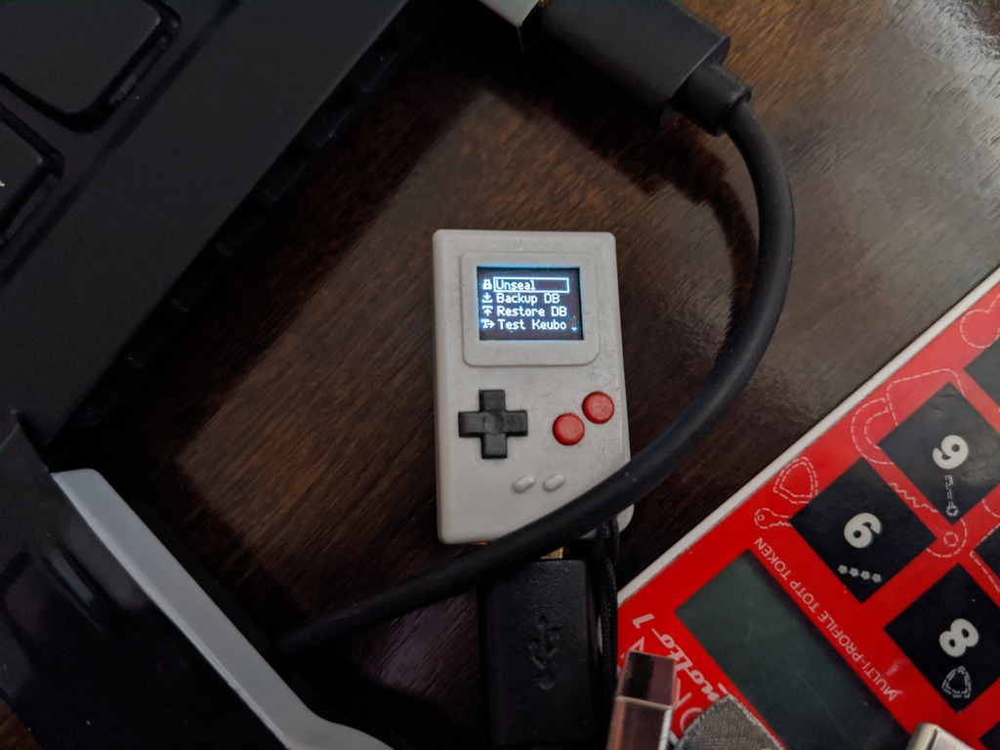

# Phraser - USB Hardware Password Manager

Phraser is a compact and secure USB hardware password manager designed to keep your passwords safe and easily accessible. Built on the Thumby platform, which is based on the RP2040 microcontroller, Phraser combines portability with robust security features.

## Features

- **Secure Storage**: Store your passwords securely with encryption.
- **Compact Design**: Keychain form factor for portability (props to [Thumby](https://thumby.us/) team).
- **Open Source**: Fully open-source firmware, Apache 2.
- **Flash-friendly DB design**: facilitates uniform flash sector wear and bit rot protection ([more info](https://github.com/flower-org/PhraserManager/blob/main/1.%20Phraser%20DB%20-%20Optimizing%20Flash%20Wear%20and%20Bit%20Rot.md)).
- **Up to 3 Password Banks**: Up to 3 independent password databases, each with it's own password.

## Phraser Manager

[Phraser Manager](https://github.com/flower-org/PhraserManager) is a desktop application designed to work seamlessly with your Phraser device and Phraser DB backups. It provides a user-friendly cross-platform interface for managing your password databases with the following features:

- **Backup Password Database**: Create backups of your password database to ensure your data is safe and recoverable.
- **Restore Password Database**: Easily restore your password database from a backup file.
- **Modify Password Entries**: Update existing password entries or metadata in DB backup files from the desktop application.
- **DB Maintenance**: Compact, resize, etc.

### Prerequisites

- [Thumby](https://thumby.us/) device
- Micro-USB cable for connection  

### Acknowledgements
- Special thanks to [Kirill Emelyanov](https://github.com/emelyanovkr) for the PlatformIO setup assistance.
